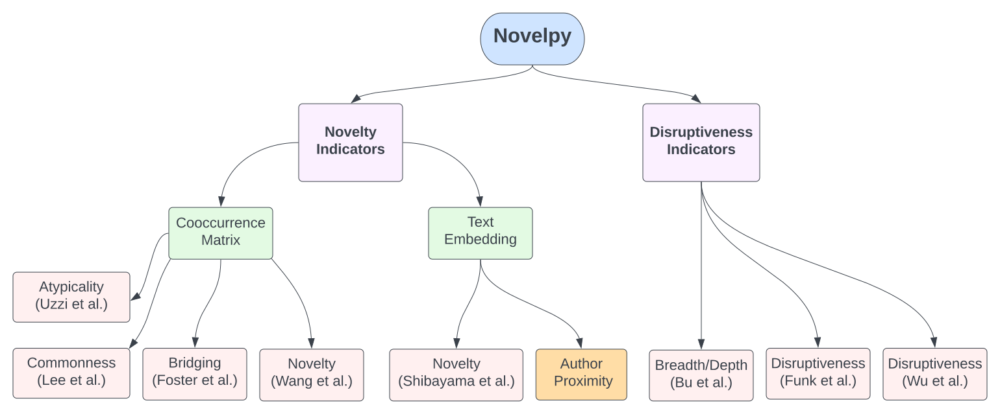
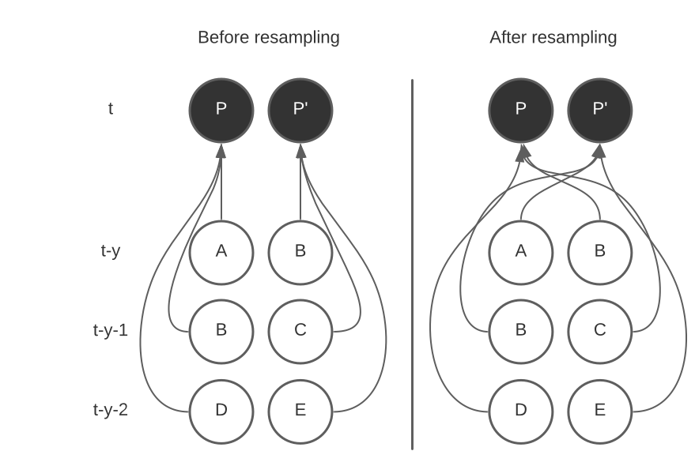
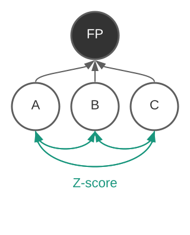
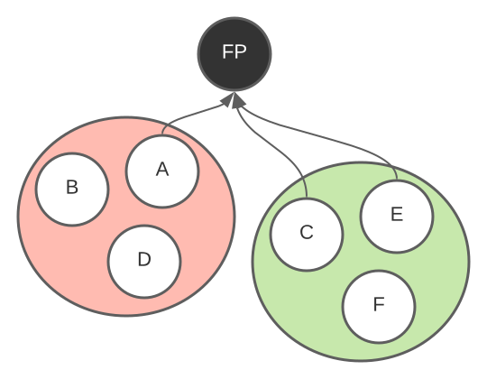
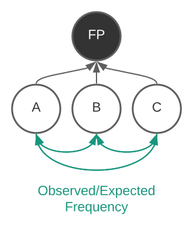
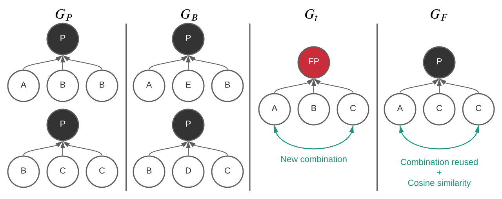
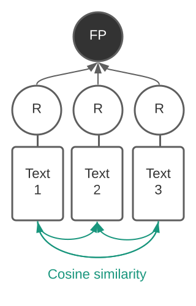

.. _Indicators:

Indicators
=====

.. _Novelty:
.. _Dirsuptiveness:

Novelty indicators
------------

Here are the novelty indicators we currently support:

Uzzi et al. [2013]
~~~~~~~~~~~~~~~~~~~~~~

The goal of the measure proposed by Uzzi et al. [2013] :cite:p:`uzzi2013atypical` is to compare an observed network (co-occurrence matrix) with a random network where edges are rearranged randomly at a year level.

P and P’ are two distinct papers; P cites journals A, B and D. P’ cites journals B, C and E. The goal is to shuffle the
network by conserving the dynamic structure of citations at the paper level. P is no longer citing A from :math:`t − y` but instead cites B from year :math:`t − y`. Comparing the observed and resampled networks, we can compute a z-score for each journal
combination.

.. py:function:: Uzzi2013(collection_name, id_variable, year_variable, variable, sub_variable, focal_year, client_name = None, db_name = None, nb_sample = 20, density = False)

   Compute the novelty score for every paper for the focal_year based on Uzzi et al. 2013 

   :param str collection_name: Name of the collection or the JSON file containing the variable.  
   :param str id_variable: Name of the key whose value gives the document's identity.
   :param str year_variable: Name of the key whose value is the year of creation of the document.
   :param str variable: Name of the key that holds the variable of interest used in combinations.
   :param str sub_variable: Name of the key which holds the ID of the variable of interest (nested dict in variable).
   :param int focal_year: Calculate the novelty score for every document with a year_variable = focal_year.
   :param str client_name: Mongo URI if the data are hosted on a MongoDB instead of a JSON file.
   :param str db_name: Name of the MongoDB.
   :param int nb_sample: Number of resampling of the co-occurrence matrix.
   :param bool density: If True, save an array where each cell is the score of a combination. If False, save only the percentile of this array

   :return: 

   :raises ValueError: 
   :raises TypeError: 

In order to run Atypicality, one first needs to create a co-occurrence matrix with self-loop = True and weighted_network = True; read more in :ref:`Usage:tutorial` and :ref:`Utils:cooc_utils`

.. code-block:: python

   import novelpy
   import tqdm

   focal_year = 2000
   Uzzi = novelpy.indicators.Uzzi2013(collection_name = 'references_sample',
                                          id_variable = 'PMID',
                                          year_variable = 'year',
                                          variable = "c04_referencelist",
                                          sub_variable = "items",
                                          focal_year = focal_year)
   Uzzi.get_indicator()

.. _foster:
Foster et al. [2015]
~~~~~~~~~~~~~~~~~~~~~~

Foster et al. [2015] :cite:p:`foster2015tradition` define novelty as an inter-community combination. A combination has a novelty score of 1 if the two items are not in the same community. The original paper used the infomap community detection algorithm. More recently, Foster et al. [2021] :cite:p:`foster2021surprise` used the Louvain algorithm. Currently, only Louvain is supported; see the :ref:`roadmap` section. The score for a given entity is the proportion of novel combinations on the total number of combination.

.. py:function:: Foster2015(collection_name, id_variable, year_variable, variable, sub_variable, focal_year, starting_year, client_name = None, db_name = None, community_algorithm = "Louvain", density = False)

   Compute novelty score for every paper for the focal_year based on Foster et al. 2015 

   :param str collection_name: Name of the collection or the JSON file containing the variable.  
   :param str id_variable: Name of the key whose value gives the document's identity.
   :param str year_variable: Name of the key whose value is the year of creation of the document.
   :param str variable: Name of the key that holds the variable of interest used in combinations.
   :param str sub_variable: Name of the key which holds the ID of the variable of interest.
   :param int focal_year: The year to start the accumulation of co-occurence matrices.
   :param int starting_year: The accumulation of co-occurrence starting at year starting_year.
   :param str client_name: Mongo URI if the data are hosted on a MongoDB instead of a JSON file
   :param str db_name: Name of the MongoDB.
   :param str community_algorithm: The name of the community algorithm to be used.
   :param bool density: If True, save an array where each cell is the score of a combination. If False, save only the percentile of this array

   :return: 

   :raises ValueError: 

   :raises TypeError: 

In order to run this novelty indicator you first need to create a co-occurence matrix with self-loop = True and weighted_network = True, read more in :ref:`Usage:tutorial` and :ref:`Utils:cooc_utils`

.. code-block:: python

   focal_year = 2000
    
   Foster = novelpy.indicators.Foster2015(collection_name = 'references_sample',
                                          id_variable = 'PMID',
                                          year_variable = 'year',
                                          variable = "c04_referencelist",
                                          sub_variable = "item",
                                          focal_year = focal_year,
                                          starting_year = 1995,
                                          community_algorithm = "Louvain")
   Foster.get_indicator()

Lee et al. [2015]
~~~~~~~~~~~~~~~~~~~~~~

Lee et al. [2015] :cite:p:`lee2015creativity` compare the observed number of combinations with the theoretical number of combinations between two items. The higher (lower) the observed (theoretical) number of combinations, the more novel the paper is. They call this measure "commonness".

.. py:function:: Lee2015(collection_name, id_variable, year_variable, variable, sub_variable, focal_year, client_name = None, db_name = None, density = False)

   Compute novelty score for every paper for the focal_year based on Foster et al. 2015 

   :param str collection_name: Name of the collection or the JSON file containing the variable.   
   :param str id_variable: Name of the key whose value gives the document's identity.
   :param str year_variable: Name of the key whose value is the year of creation of the document.
   :param str variable: Name of the key that holds the variable of interest used in combinations.
   :param str sub_variable: Name of the key which holds the ID of the variable of interest.
   :param int focal_year: Calculate the novelty score for every document with a date of creation = focal_year.
   :param str client_name: Mongo URI if the data are hosted on a MongoDB instead of a JSON file
   :param str db_name: Name of the MongoDB.
   :param bool density: If True, save an array where each cell is the score of a combination. If False, save only the percentile of this array

   :return: 

   :raises ValueError: 

   :raises TypeError: 

In order to run "commonness" you first need to create a co-occurrence matrix with self-loop = True and weighted_network = True; read more in :ref:`Usage:tutorial` and :ref:`Utils:cooc_utils`

.. code-block:: python

   import novelpy

   focal_year = 2000

   Lee = novelpy.indicators.Lee2015(collection_name = 'references_sample',
                                          id_variable = 'PMID',
                                          year_variable = 'year',
                                          variable = "c04_referencelist",
                                          sub_variable = "item",
                                          focal_year = focal_year)
   Lee.get_indicator()

Wang et al. [2017]
~~~~~~~~~~~~~~~~~~~~~~

Wang et al. [2017] :cite:p:`wang2017bias` proposed a measure of difficulty on pair of references that were never made before, but that are reused after the given publication’s year (Scholars do not have to cite directly the paper that created the combination but only the combination itself). The idea is to compute the cosine similarity for each journal combination based on their co-citation profile b years before t.

.. py:function:: Wang2017(collection_name, id_variable, year_variable, variable, sub_variable, focal_year, starting_year, time_window_cooc, n_reutilisation,client_name = None, db_name = None)

   Compute novelty score for every paper for the focal_year based on Wang et al.. 2013 

   :param str collection_name: Name of the collection or the JSON file containing the variable.   
   :param str id_variable: Name of the key whose value gives the document's identity.
   :param str year_variable: Name of the key whose value is the year of creation of the document.
   :param str variable: Name of the key that holds the variable of interest used in combinations.
   :param str sub_variable: Name of the key which holds the ID of the variable of interest.
   :param int focal_year: Calculate the novelty score for every document with a date of creation = focal_year.
   :param str client_name: Mongo URI if the data are hosted on a MongoDB instead of a JSON file
   :param str db_name: Name of the MongoDB.
   :param bool density: If True, save an array where each cell is the score of a combination. If False, save only the percentile of this array
   :param int time_window_cooc: Calculate the novelty score using the accumulation of the co-occurence matrix between focal_year-time_window_cooc and focal_year.
   :param int n_reutilisation: Check if the combination is reused n_reutilisation year after the focal_year
   :param int keep_item_percentile: Between 0 and 100. Keep only items that appear more than keep_item_percentile% of every items

   :return: 

   :raises ValueError: 
   :raises TypeError: 

In order to run the indicator, one first needs to create a co-occurrence matrix with self-loop = True and weighted_network = True; read more in :ref:`Usage:tutorial` and :ref:`Utils:cooc_utils`

.. code-block:: python

   import novelpy

   focal_year = 2000

   Wang = novelpy.indicators.Wang2017(collection_name = 'references_sample',
                                          id_variable = 'PMID',
                                          year_variable = 'year',
                                          variable = "c04_referencelist",
                                          sub_variable = "item",
                                          time_window_cooc = 3,
                                          n_reutilisation = 1)
   Wang.get_indicator()
    

Shibayama et al. [2021]
~~~~~~~~~~~~~~~~~~~~~~

:cite:p:`shibayama2021measuring`

.. py:function:: Shibayama2021(id_variable, year_variable, ref_variable, entity, focal_year, embedding_dim = 200, collection_name, client_name = None, db_name = None, distance_type = "cosine", density=False)

   Compute novelty score for every paper for the focal_year based on Uzzi et al. 2013 

   :param str id_variable: Name of the key whose value gives the document's identity.
   :param str year_variable: Name of the key whose value is the year of creation of the document.
   :param str ref_variable: Name of the key whose value is the list of ids cited by the doc
   :param list entity: Which variables embedded to run the algorithm (e.g ["title","abstract"])
   :param int focal_year: Calculate the novelty score for every document with a year_variable = focal_year.
   :param int embedding_dim: Dimension of the embedding of entity.
   :param str collection_name: Name of the collection or the JSON file containing the variable.  
   :param str collection_embedding_name: Name of the collection or the JSON file containing the entity embedded.  
   :param str client_name: Mongo URI if the data are hosted on a MongoDB instead of a JSON file.
   :param str db_name: Name of the MongoDB.
   :param fun distance_type : distance function, this function need to take an array with documents as row and features as columns. It needs to return a square matrix of distance between documents
   :param bool density: If True, save an array where each cell is the score of a distance between a pair of document. If False, save only the percentiles of this array

   :return: 

   :raises ValueError: 
   :raises TypeError: 

In order to run the indicator you first need to embed articles using the function "Embedding", read more in :ref:`Usage:tutorial` and :ref:`Utils:embedding`

.. code-block:: python

   import novelpy

   focal_year = 2000
   shibayama = novelpy.indicators.Shibayama2021(
      collection_name = 'Citation_net_sample',
      collection_embedding_name = 'embedding',
      id_variable = 'PMID',
      year_variable = 'year',
      ref_variable = 'refs_pmid_wos',
      entity = ['title_embedding','abstract_embedding'],
      focal_year = focal_year,
      density = True)

   shibayama.get_indicator()

Disruptiveness indicators
----------------

Wu et al. [2019]/  Bornmann et al. 2019/ Bu et al. [2019]
~~~~~~~~~~~~~~~~~~~~~~

:cite:p:`wu2019solo` & :cite:p:`bornmann1911disruption`

:cite:p:`bu2019multi`

All indicators are computed at the same time, one need to run the following command and iterate over the citation database:

.. py:function:: Disruptiveness(client_name = None, db_name = None, collection_name, focal_year, id_variable, refs_list_variable, year_variable)

   Compute several indicators of disruptiveness studied in Bornmann and Tekles (2020) and in Bu et al. (2019)
  
   :param str collection_name: Name of the collection or the JSON file containing the variables. 
   :param int focal_year: Calculate the novelty score for every document with a year_variable = focal_year.
   :param str id_variable: Name of the key whose value gives the document's identity.
   :param str refs_list_variable : Name of the key whose value is a List of IDs cited by the focal paper.
   :param str cits_list_variable : Name of the key whose value is a List of IDs that cite the focal paper
   :param int focal_year: Calculate the novelty score for every document with a year_variable = focal_year.
   :param str id_variable: Name of the key whose value gives the document's identity.
   :param str year_variable : Name of the key whose value is the year of creation of the document.
   :param str client_name: Mongo URI if the data are hosted on a MongoDB instead of a JSON file.
   :param str db_name: Name of the MongoDB.

.. code-block:: python

   import novelpy

   focal_year = 2000

   disruptiveness = novelpy.Disruptiveness(
     collection_name = 'Citation_net_sample_cleaned',
     focal_year = year,
     id_variable = 'PMID',
     refs_list_variable ='refs',
     cits_list_variable = 'cited_by',
     year_variable = 'year')

   disruptiveness.get_indicators()

References
----------------
.. bibliography::
