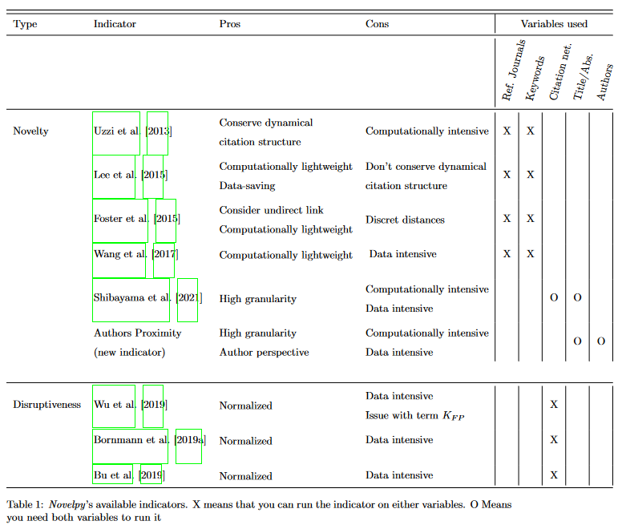
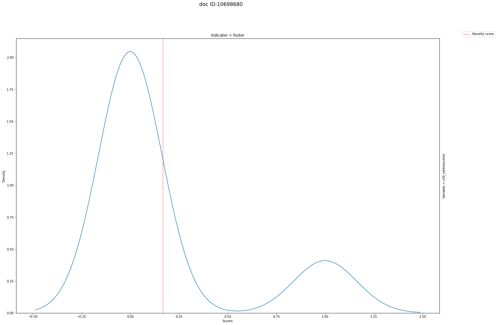
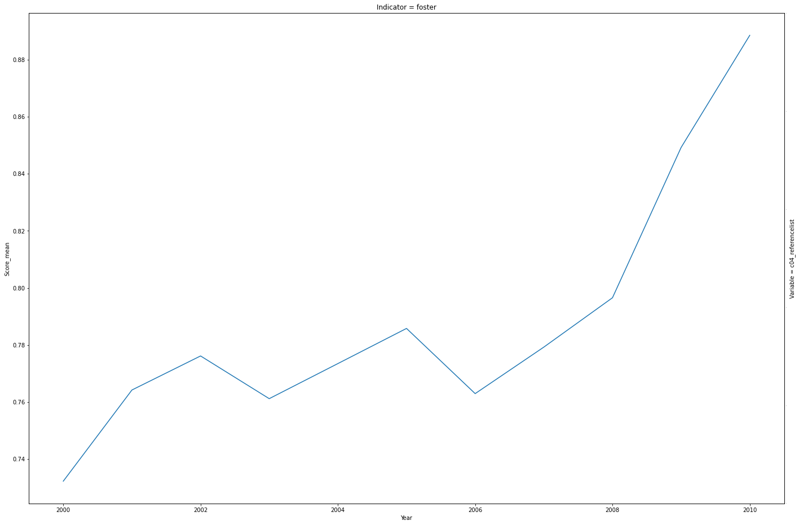
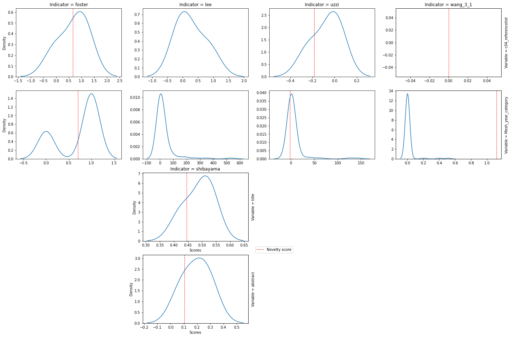
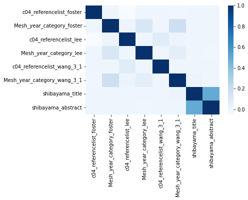

.. _Usage:

Usage
=====

.. _installation:
Installation
------------

To use novelpy, first install it using pip:

.. code-block:: console

   $ pip install novelpy

.. _format:
Format supported
----------------

The package currently supports JSON files which should be located in Data/docs or a MongoDB. Here is a typical starting folder structure to run novelpy if one use JSON:

::

   project
   ├── demo.py
   └── Data   
      └── docs      
          ├── Ref_Journals
          │   ├ 2001.json
          │   └ 2002.json
          │ 
          └── Meshterms
              ├ 2001.json
              └ 2002.json

| Depending on the kind of indicator, one needs different kinds of input (For example, for Lee et al. [2015] :cite:p:`lee2015creativity`, one only needs the journal name of the references for the focal articles). 
|
| We intend to automatize the process with well-known Databases (Web of Science, ArXiv, Pubmed Knowledge graph, ...). Look into the :ref:`roadmap` section to learn
| more about future implementation.
|
| To use other data sources, please look into the :ref:`Usage:Sample` section below to learn more about the expected data structure and :ref:`Usage:tutorial` to learn the basic usages of the package.

.. _sample:
Sample
----------------

We made available a small sample of data so one can get familiar with the package and the data structure needed. To get this sample, one needs to run the following code in the "project" folder:

>>> from novelpy.utils.get_sample import download_sample
>>> download_sample()

| This will give you files, as seen above. Read more about this sample structure `here <https://zenodo.org/record/5768348#.YdMGWlnjImA>`_.
| If you want to test the package with MongoDB you can run the following, which will create a database "novelty_sample" with everything needed:

>>> download_sample(client_name="mongodb://localhost:27017")

Note that you will have the JSON files in both cases. Please delete the files if you use MongoDB and do not want duplicates (saving memory is always good).

.. _structure:
More on the structure expected
----------------

Depending on the indicator you will run you'll need different info/variables/format. Here's a short summary of all the indicators and the variables you can run them on.

For Foster et al. [2015] :cite:p:`foster2015tradition`, Lee et al. [2015] :cite:p:`lee2015creativity` and Wang et al. [2017] :cite:p:`wang2017bias` you only need two pieces of information of a document.
The year of creation of the document and the entities they use

.. code-block:: python

   # Example of a single paper information

   dict_Ref_Journals = {"PMID": 16992327, "year": 1896, "c04_referencelist": [{"item": "0022-3751"}]}
   # OR
   dict_Meshterms = {"PMID": 12255534, "year": 1902, "Mesh_year_category": [{"descUI": "D000830"}, {"descUI": "D001695"}]}

For Uzzi et al. [2013] :cite:p:`uzzi2013atypical` you will need one more information, the year of creation of the entity, in order to do the resampling.

.. code-block:: python

   # Example of a single paper information

   dict_Ref_Journals = {"PMID": 16992327, "year": 1896", "c04_referencelist": [{"item": "0022-3751", "year": 1893}]}
   # OR
   dict_Meshterms = {"PMID": 12255534, "year": 1902, "Mesh_year_category": [{"descUI": "D000830", "year": 1999}, {"descUI": "D001695", "year": 1999}]}

For text embedding indicators, one need different entities. 

To run Shibayama et al. [2021] :cite:p:`shibayama2021measuring`, one needs the Citation_network (i.e. the ID of papers the document cite) but also the abstract and/or title of papers.

.. code-block:: python

   # Example of a single paper information

   dict_citation_net = {"PMID": 20793277, "year": 1850, "refs_pmid_wos": [20794613, 20794649, 20794685, 20794701, 20794789, 20794829]}
   # AND
   dict_title_abs = {"PMID": 20793277, "year": 1850, "ArticleTitle": "Here is the title", "a04_abstract":[{"AbstractText":"This is the abstract"}]}
   # You can also have the following format for title abs. In this case leave the abstract_sub_variable argument empty
   dict_title_abs = {"PMID": 20793277, "year": 1850, "ArticleTitle": "Here is the title", "a04_abstract":"This is the abstract"}

To run Pelletier et Wirtz [2022] you need the abstract or/and title of papers but also the list of authors for each paper.

.. code-block:: python

   # Example of a single paper information

   dict_authors_list = {"PMID": 20793277, "year": 1850, "a02_authorlist": [{"id":201645},{"id":51331354}]}
   # AND
   dict_title_abs = {"PMID": 20793277, "year": 1850, "ArticleTitle": "Here is the title", "a04_abstract":[{"AbstractText":"This is the abstract"}]}
   # You can also have the following format for title abs. In this case leave the abstract_sub_variable argument empty
   dict_title_abs = {"PMID": 20793277, "year": 1850, "ArticleTitle": "Here is the title", "a04_abstract":"This is the abstract"}

Finally, for disruptiveness indicators, one only need the citation network.

.. code-block:: python

   # Example of a single paper information

   dict_citation_net = {"PMID": 20793277, "year": 1850, "refs_pmid_wos": [20794613, 20794649, 20794685, 20794701, 20794789, 20794829]}

.. _tutorial:
Tutorial
----------------

This tutorial is built upon the sample available above in JSON format. The extension to MongoDB is straightforward and requires adding the "client_name" and "db_name" arguments in each function. Make sure to run the code in the "project" folder (demo.py in :ref:`Usage:format`)

Here is a straightforward implementation to run Foster et al. [2015] :cite:p:`foster2015tradition` novelty indicator. Currently, all available indicators are based on the idea that new knowledge is created by combining already existing pieces of knowledge. Because of this, one will require co-occurrence matrices. The element ij of the co-occurrence matrix is the number of times the combination of item i and j appeared for a given year. We made it so the co-occurrence matrices are saved in the pickle format in order to save time when running different indicators :

.. code-block:: python
   
   # demo.py
   import novelpy

   ref_cooc = novelpy.utils.cooc_utils.create_cooc(
                    collection_name = "Ref_Journals_sample",
                    year_var="year",
                    var = "c04_referencelist",
                    sub_var = "item",
                    time_window = range(1995,2016),
                    weighted_network = True, self_loop = True)

   ref_cooc.main()

| This will create the co-occurrence matrix for each year between 1995 and 2015 included. Read more on it in :ref:`Utils`.
| Now you should have a new folder "cooc". Depending on the arguments, different folders are created. In the tutorial case, we wanted the co-occurrence matrix of journals cited per paper.

::

   project
   ├── demo.py
   └── Data   
      ├── docs
      │   ├── Ref_Journals_sample
      │   │   ├ 1995.json
      │   │   ├ 1996.json
      │   │   ├ ...                  
      │   │   └ 2015.json
      │   │ 
      │   └── Meshterms_sample
      │       ├ 1995.json
      │       ├ 1996.json
      │       ├ ...                  
      │       └ 2015.json
      │ 
      └── cooc
         └── c04_referencelist
             └── weighted_network_self_loop
                 ├ 1995.p
                 ├ 1996.p
                 ├ ...
                 ├ 2015.p
                 ├ index2name.p
                 └ name2index.p

| Since we use sparse matrices, index2name.p and name2index.p are required to convert the name of items to index in our matrix. Now we can run the novelty indicator of Foster et al. [2015] :cite:p:`foster2015tradition`.

.. code-block:: python

   # demo.py

   import novelpy
   import tqdm

   for focal_year in tqdm.tqdm(range(2000,2011), desc = "Computing indicator for window of time"):
       Foster = novelpy.indicators.Foster2015(collection_name = "Ref_Journals_sample",
                                              id_variable = 'PMID',
                                              year_variable = 'year',
                                              variable = "c04_referencelist",
                                              sub_variable = "item",
                                              focal_year = focal_year,
                                              starting_year = 1995,
                                              community_algorithm = "Louvain",
                                              density = True)
       Foster.get_indicator()
    

| Here, the indicator is calculated using the co-occurrence matrix done before. You can change the period depending on your data, read more here :ref:`Indicators:foster`.
| Now you should have one more folder "Results" with a JSON for the focal year with the results.

::

   project
   ├── demo.py
   ├── Data   
   │  ├── docs
   │  │   ├── Ref_Journals_sample
   │  │   │   ├ 1995.json
   │  │   │   ├ 1996.json
   │  │   │   ├ ...                  
   │  │   │   └ 2015.json
   │  │   │ 
   │  │   └── Meshterms_sample
   │  │       ├ 1995.json
   │  │       ├ 1996.json
   │  │       ├ ...                  
   │  │       └ 2015.json
   │  │ 
   │  └── cooc
   │     └── c04_referencelist
   │         └── weighted_network_self_loop
   │            ├ 1995.p
   │            ├ 1996.p
   │            ├ ...
   │            ├ 2015.p
   │            ├ index2name.p
   │            └ name2index.p
   └── Results
      └── foster
         └── c04_referencelist
            ├ 2000.json
            ├ ...
            └ 2010.json

| Some pre-build functions can help you perform your analysis by getting the novelty score of a document, plotting the distribution and looking at the trend of the novelty score over the years.

.. code-block:: python
   
   import novelpy

   # Easy plot

   dist = novelpy.utils.plot_dist(client_name="mongodb://localhost:27017",
                                  db_name = "novelty_sample",
                                  doc_id = 20100198,
                                  doc_year = 2010,
                                  id_variable = "PMID",
                                  variables = ["c04_referencelist"],
                                  indicators = ["foster"])
   dist.get_plot_dist()
   
   # The data used for the plot can be found in dist.df

.. code-block:: python
   
   import novelpy

   # Trend
   trend = novelpy.utils.novelty_trend(year_range = range(2000,2011,1),
                 variables = ["c04_referencelist"],
                 id_variable = "PMID",
                 indicators = ["foster"])

   trend.get_plot_trend()

| Here's a script to run all indicators in the package that uses the co-occurrence matrices on all the variables available in the sample.

.. code-block:: python

   # demo.py
   import novelpy
   import tqdm

   # all the cooc possible not including the one done above

   ref_cooc = novelpy.utils.cooc_utils.create_cooc(
                    collection_name = "Ref_Journals_sample",
                    year_var="year",
                    var = "c04_referencelist",
                    sub_var = "item",
                    time_window = range(1995,2016),
                    weighted_network = False, self_loop = False)

   ref_cooc.main()

   ref_cooc = novelpy.utils.cooc_utils.create_cooc(
                    collection_name = "Meshterms_sample",
                    year_var="year",
                    var = "Mesh_year_category",
                    sub_var = "descUI",
                    time_window = range(1995,2016),
                    weighted_network = True, self_loop = True)

   ref_cooc.main()

   ref_cooc = novelpy.utils.cooc_utils.create_cooc(
                    collection_name = "Meshterms_sample",
                    year_var="year",
                    var = "Mesh_year_category",
                    sub_var = "descUI",
                    time_window = range(1995,2016),
                    weighted_network = False, self_loop = False)

   ref_cooc.main()

   # Uzzi et al.(2013) Meshterms_sample
   for focal_year in tqdm.tqdm(range(2000,2011), desc = "Computing indicator for window of time"):
       Uzzi = novelpy.indicators.Uzzi2013(collection_name = "Meshterms_sample",
                                              id_variable = 'PMID',
                                              year_variable = 'year',
                                              variable = "Mesh_year_category",
                                              sub_variable = "descUI",
                                              focal_year = focal_year,
                                              density = True)
       Uzzi.get_indicator()

   # Uzzi et al.(2013) Ref_Journals_sample
   for focal_year in tqdm.tqdm(range(2000,2011), desc = "Computing indicator for window of time"):
       Uzzi = novelpy.indicators.Uzzi2013(collection_name = "Ref_Journals_sample",
                                              id_variable = 'PMID',
                                              year_variable = 'year',
                                              variable = "c04_referencelist",
                                              sub_variable = "item",
                                              focal_year = focal_year,
                                              density = True)
       Uzzi.get_indicator()

   # Foster et al.(2015) Meshterms_sample
   for focal_year in tqdm.tqdm(range(2000,2011), desc = "Computing indicator for window of time"):
       Foster = novelpy.indicators.Foster2015(collection_name = "Meshterms_sample",
                                              id_variable = 'PMID',
                                              year_variable = 'year',
                                              variable = "Mesh_year_category",
                                              sub_variable = "descUI",
                                              focal_year = focal_year,
                                              starting_year = 1995,
                                              community_algorithm = "Louvain",
                                              density = True)
       Foster.get_indicator()

   # Lee et al.(2015) Meshterms_sample
   for focal_year in tqdm.tqdm(range(2000,2011), desc = "Computing indicator for window of time"):
       Lee = novelpy.indicators.Lee2015(collection_name = "Meshterms_sample",
                                              id_variable = 'PMID',
                                              year_variable = 'year',
                                              variable = "Mesh_year_category",
                                              sub_variable = "descUI",
                                              focal_year = focal_year),
                                              density = True
       Lee.get_indicator()

   # Lee et al.(2015) Ref_Journals_sample
   for focal_year in tqdm.tqdm(range(2000,2011), desc = "Computing indicator for window of time"):
       Lee = novelpy.indicators.Lee2015(collection_name = "Ref_Journals_sample",
                                              id_variable = 'PMID',
                                              year_variable = 'year',
                                              variable = "c04_referencelist",
                                              sub_variable = "item",
                                              focal_year = focal_year,
                                              density = True)
       Lee.get_indicator()

   # Wang et al.(2017) Meshterms_sample
   for focal_year in tqdm.tqdm(range(2000,2011)):
       Wang = novelpy.indicators.Wang2017(collection_name = "Meshterms_sample",
                                              id_variable = 'PMID',
                                              year_variable = 'year',
                                              variable = "Mesh_year_category",
                                              sub_variable = "descUI",
                                              focal_year = focal_year,
                                              time_window_cooc = 3,
                                              n_reutilisation = 1,
                                              starting_year = 1995,
                                              density = True)
       Wang.get_indicator()

   # Wang et al.(2017) Ref_Journals_sample
   for focal_year in tqdm.tqdm(range(2000,2011)):
       Wang = novelpy.indicators.Wang2017(collection_name = "Ref_Journals_sample",
                                              id_variable = 'PMID',
                                              year_variable = 'year',
                                              variable = "c04_referencelist",
                                              sub_variable = "item",
                                              focal_year = focal_year,
                                              time_window_cooc = 3,
                                              n_reutilisation = 1,
                                              starting_year = 1995,
                                              density = True)
       Wang.get_indicator()

| Now for text-embedding indicators. We do not need co-occurrence matrices for Shibayama et al. [2021] :cite:p:`shibayama2021measuring`. We need the title or abstract (in our case, we have both) for articles cited by focal papers and, therefore, the id for each paper cited. One can find this information in the sample in two DBs: "Title_abs_sample" and "Citation_net_sample". We then embed the articles using spacy and do a cosine similarity between the embeddings of cited papers for focal papers. One can find a pre train here https://pypi.org/project/scispacy/. We used en_core_sci_lg-0.4.0. The pretrain_path can be changed depending on the one needed.

| Let's start with the embedding:

.. code-block:: python

    from novelpy.utils.embedding import Embedding
    
    embedding = Embedding(
    		year_variable = 'year',
    		time_range = range(2000,2011),
    		id_variable = 'PMID',
    		references_variable = 'refs_pmid_wos',
    		pretrain_path = 'en_core_sci_lg-0.4.0/en_core_sci_lg/en_core_sci_lg-0.4.0',
    		title_variable = 'ArticleTitle',
    		abstract_variable = 'a04_abstract',
    		abstract_subvariable = 'AbstractText')
    
    # articles
    
    embedding.get_articles_centroid(
          collection_articles = 'Title_abs_sample',
          collection_embedding = 'embedding',
          year_range = range(2000,2011,1))

| one new DB will be created, one with the id of the articles and its embedding called "embedding". Now we can run Shibayama et al. [2021] :cite:p:`shibayama2021measuring`:

.. code-block:: python

   import novelpy
   import tqdm

   for focal_year in tqdm.tqdm(range(2000,2011), desc = "Computing indicator for window of time"):
    shibayama = novelpy.indicators.Shibayama2021(client_name="mongodb://localhost:27017",
                                    db_name = "novelty_sample",
         collection_name = 'Citation_net_sample',
         collection_embedding_name = 'embedding',
         id_variable = 'PMID',
         year_variable = 'year',
         ref_variable = 'refs_pmid_wos',
         entity = ['title_embedding','abstract_embedding'],
         focal_year = focal_year,
         density = True)
    
    shibayama.get_indicator()
 

        

| To run Pelletier et Wirtz [2022], one needs to have the title or abstract (in our case we have both) for articles and the list of authors for the document. This will allow the creation of a new collection where each document is an author ID with a list of embedded references (i.e. Papers to which this author contributed) 

.. code-block:: python

   from novelpy.utils import Embedding
   from novelpy.utils import create_authors_past
   import novelpy
    
   # First step is to create a collection where each doc contains the author ID and its list of document he coauthored
   clean = create_authors_past(client_name = 'mongodb://localhost:27017',
                                db_name = 'novelty_sample',
                                collection_name = "authors_sample",
                                id_variable = "PMID",
                                variable = "a02_authorlist",
                                sub_variable = "AID")
    
   clean.author2paper()
   clean.update_db()

   embedding = Embedding(
         year_variable = 'year',
         id_variable = 'PMID',
         references_variable = 'refs_pmid_wos',
         pretrain_path = r'en_core_sci_lg-0.4.0\en_core_sci_lg\en_core_sci_lg-0.4.0',
         title_variable = 'ArticleTitle',
         abstract_variable = 'a04_abstract',
         abstract_subvariable = 'AbstractText',
         aut_id_variable = 'AID',
         aut_pubs_variable = 'doc_list')

   """
   embedding.get_articles_centroid(
         collection_articles = 'Title_abs_sample',
         collection_embedding = 'embedding')
   """

   embedding.feed_author_profile(
       aut_id_variable = 'AID',
       aut_pubs_variable = 'doc_list',
       collection_authors = 'authors_sample_cleaned',
       collection_embedding = 'embedding')

| Then to run the indicator

.. code-block:: python

    from novelpy.indicators.Author_proximity import Author_proximity
    
    for year in range(2000,2011):
    	author =  Author_proximity(
    	                     collection_name = 'authors_sample',
    	                     id_variable = 'PMID',
    	                     year_variable = 'year',
    	                     aut_list_variable = 'a02_authorlist',
    	                     aut_id_variable = 'AID',
    	                     entity = ['title','abstract'],
    	                     focal_year = year,
    	                     windows_size = 5,
                           density = True)
    	    
    	author.get_indicator()

| Now you can create more advanced plot:

.. code-block:: python

   dist = novelpy.utils.plot_dist(
                                  doc_id = 20100198,
                                  doc_year = 2010,
                                  id_variable = "PMID",
                                  variables = ["c04_referencelist","Mesh_year_category"],
                                  indicators = ["foster","lee","uzzi","wang","shibayama"],
                                  time_window_cooc = [3],
                                  n_reutilisation = [1],
                                  embedding_entities = ["title","abstract"])

   dist.get_plot_dist()

.. code-block:: python

   trend = novelpy.utils.novelty_trend(year_range = range(2000,2011,1),
                 variable = ["c04_referencelist","a06_meshheadinglist"],
                 id_variable = "PMID",
                 indicator = ["foster","commonness"],
                 time_window_cooc = [3],
                 n_reutilisation = [1])

   trend.get_plot_trend()

.. image:: img/trend_complex.png
   :width: 900

.. code-block:: python

   correlation = novelpy.utils.correlation_indicators(year_range = range(2000,2011,1),
                 variables = ["c04_referencelist","Mesh_year_category"],
                 indicators = ["foster","lee","wang","shibayama"],
                 time_window_cooc = [3],
                 n_reutilisation = [1],
                 embedding_entities = ["title","abstract"])

   correlation.correlation_heatmap(per_year = False)

| Of course, the plots are here to guide readers in their analysis, to make some pretty plots, one can use the data inside the class instance or from the files.
